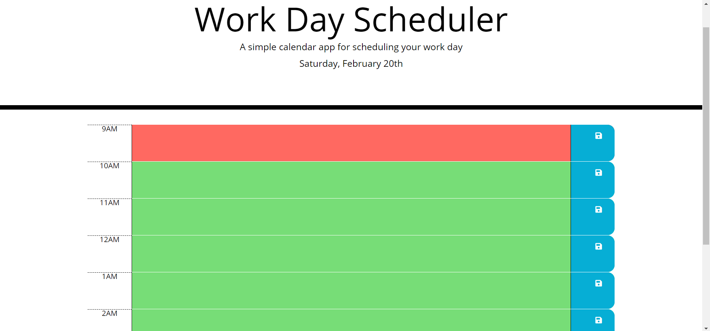

# Work-Day-Scheduler

This app is used to keep track of daily events.

The current date loads at the top of the page.

There are nine blocks of time, each one representing an hour from 9AM to 5PM.

Each block will be colored depending on the time of day. Past hours are colored gray, the current hour is red, and future hours are green.

The user can input events for each hour. Clicking the save button on a row with an event will store the event in local storage and bring it back on a refresh.

A link to the website: https://djlongarms.github.io/Work-Day-Scheduler/

A screenshot of the website: 